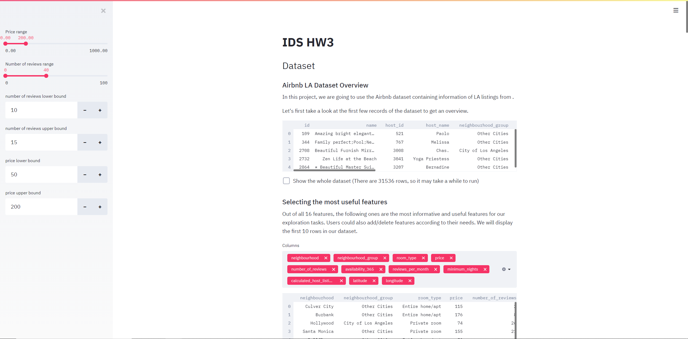

# Project name: LA Airbnb Pricing

This project used the Airbnb dataset which contains LA listings. Our main goal is to gain an overview of the Airbnb listings in LA, especially their prices, number of reviews etc. and be able to get an estimation of price given some key information.

## Project Goals

Our project is designed to answer the following questions, which are proposed mainly from the perspective of Airbnb customers.     
- What are the distributions of price, number of reviews and room type of the Airbnbs located in LA?
- What are the most expensive neighboorhoods and the cheapest neighboorhouds?
- What are the most expensive room type and the least expensive room type?
- Where are the most and least popular/legit properties located in Los Angeles on the map?
- Where are the most expensive and cheapest properties located in Los Angeles on the map?
- What is the price estimation given number of reviews, availability in one year, minimum nights required, and host listings counts?

## Design

- Airbnb LA Listings

    Most of the users of Airbnb are interested in the price. So we chose it to be the main variable of interest in our project. Then, we took a closer look at the dataset which contains in total of 16 variables. Among these variables, we selected a subset of columns which are able to sufficiently answer our research questions. These variables are neighbourhood_group, neighbourhood, latitude, longitude, room_type, price, minimum_nights, number of reviews, reviews_per_month, calculated_host_listings_count, availability_365). We generated a table with these key variables from our dataset. Users are also allowed to choose the variables they are interested in by themselves.

    We included this interactive table, because we think it would be good for the users to select the columns that they think are more important according to their personal needs.

- Distribution of variables

    We plotted out the distributions of the main variables we are interested in. To make it more interactive, we added sidebars to each of the histograms which allow users to select a custom range of their interests. To determine the optimal range of the sidebar, we first select the range that covers all the values, then we clipped the upper bound to remove the outliers.

    We added interaction techniques to these plots as we think it would be good for the user to select ranges by themselves, which enables them so to see the distributions more clearly in a smaller range.

- What are the most expensive and cheapest neighbourhoods？What are the most expensive room type and the least expensive one?

    Then We are curious about which neighborhoods are more expensive and which are cheaper. We found that Rolling Hills has an average price of $2667.6 which is the most expensive one in LA. Cudahy has an average price of $14 which is the cheapest one.

    Then, we also would like to know the averge prices of all the room types. We found that entire home or apartment has the highest average price and shared room has the lowest average price. This result is quite intuitive.

    We used tables to represent these data as information can be displayed in a clear and direct manner. 

- Where are the most expensive and cheapest properties located on the map? 

    Then We are curious about where are the most expensive properties located in LA. Since we have the latitude and longitude variables in our dataset, we think it would be good to plot out interactive maps that enable different levels of views by zooming in or out. Thus, we generated maps to show the most expensive Airbnbs priced at $800 and above. The result indicated that most of the expensive properties are concentrated in the Beverly Hills and West Hollywood neighborhoods. Also, some of them are scattered around the coastline. We are also curious about where are the cheapest properties located in LA so we plot out another map for those priced at $50 and below. It turns out that they are roughly evenly distributed on the map. 

    We also displayed the top five most expensive properties and the top five cheapest properties using tables. One interesting fact we noticed was that the top five cheapest properties all had a listing price of 0. 

- Where are the most and least popular/legit properties located on the map?

    Furthermore, we want to know where are the most popular/legit properties(those with the most number of reviews) and the least popular/legit properties located. So again we plot out two maps to see the distributions. We noticed that the distribution of the most popular properties on map is similar to that of the most expensive properties. Also, the distribution of the least popular properties on map is similar to that of the cheapest properties. This indicates that it is likely that price is positively associated with number of reviews.

    We also displayed the top five most popular properties and the top five least popular properties using tables.

- Listing Price Prediction
    
    We finally deployed a Linear Regression model to predict the price with four different variables so that users can specify values for these variables in order to get an estimate.  These four variables are number of reviews, availability in one year, minimum nights, and calculated host listings count. 
    
    One alternative we considered was the Random Forest model, which is more likely to have a better-predicted result due to its complexity. However, it takes a long time to run so we finally decided to use Linear Regression to obtain a reasonably good prediction with high computational efficiency.

## Development

- We first tried to search for a good dataset for our project. Since we are about to take a trip to Los Angeles during Thanksgiving, we would like to know the Airbnb situation there before the trip. Also, this dataset is relatively clean with a small portion of n/a values and contains geographic features which are good for developing interative applications. **[3 hours (together)]**

- We think it is important to determine the goals of this project before we start working on it. So, we set up a meeting, did some investigations on the  questions that might be of the most interest to the customers of Airbnb. **[1.5 hours (together)]**

- We then carefully investigated the dataset and came up with our final research questions. We first brainstormed the questions separately, then combined our thoughts together. After that, we select certain useful features among all the columns that would help us answer these questions. Then we preprocessed the dataset by filtering out the nan values and removing columns that we are not interested in. We also did some feature engineering on the dataset, and in particular, we created one-hot encoding features from room_type and neighbourhood. **[4 hours (each)]**

- Then, Xi did exploratory data analysis on the dataset, such as plotting out the distributions of certain variables. And Shengli plot out the maps to show the locations of the most expensive and cheapest properties. **[2 hours (1 hour each person)]**

- We then together did the rest of the project to answer the remaining questions we proposed, such as obtaining the average prices of the top 5 most expensive and cheapest neighborhoods, and average prices by room type. **[2 hours (together)]**

- We then engaged in a very intense discussion on which model to choose for price prediction. We initially thought about Random Forest, because we want to include different variable types in the predictors, including integers, floats, and OHE vectors. However, when we deployed it, it took around 3 minutes for our project to run, which is not very efficient for an interactive project. So, we decided to switch to another model which can fit the data more efficiently. Linear regression was our final choice. **[5 hours (together)]**

- After finished coding, we wrote the whole writeup together and submitted it to Github. **[2 hours (together)]**